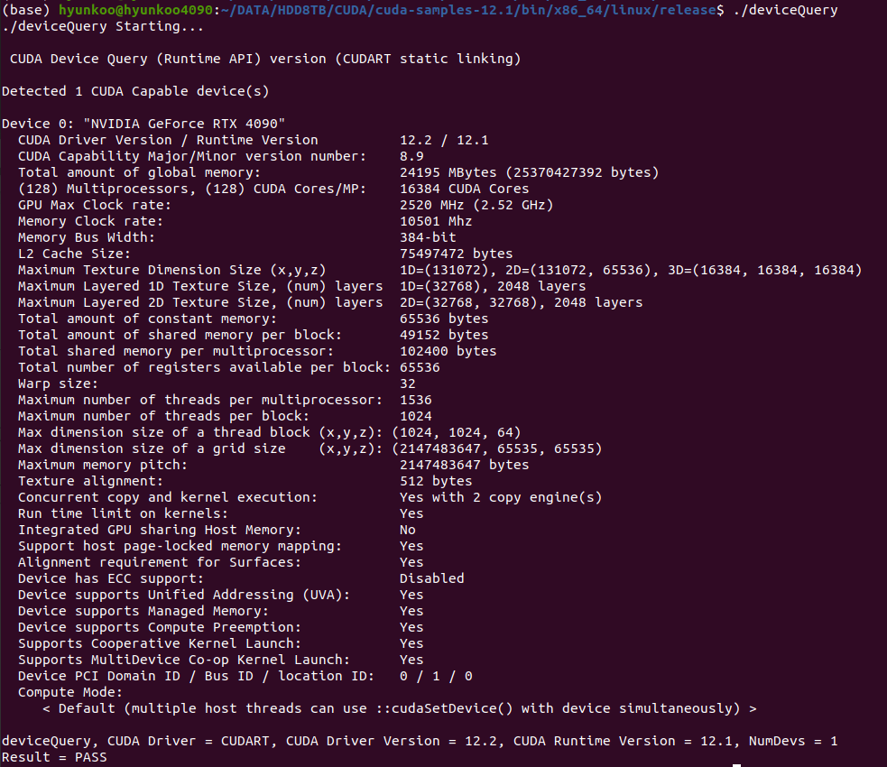

# Memory Structure

### adjacent differences 인접 원소끼리 차이 구하기 

***Data Access Patterns***
- Carefully partition data according to access patterns
  - R/W within `each thread`
    - → `registers` (fast)
  - R/W & `shared within block` 
    - → `__shared__ memory` (fast)
  - `Read-only` 
    - → `__constant__ memory` (fast)
  - Indexed R/W within each thread, 즉 `배열`이라면,  
    - → `local memory` (slow)
  - R/W inputs/results `상당히 크고, 일반적인 데이터`라면 
    - → 변수 선언 보다는, `cudaMalloc` 을 사용하는 편이 확장성이 더 좋음 
    - → `cudaMalloc'`ed `global memory` (slow)
- a kind of divide and conquer approach
  - data: divided into smaller ones in the shared memory

***Race Condition: shared memory case***
- 해결 방법: Barrier Synchronization
  - CUDA intrinsic functions 내장 함수: 
    - 컴퍼일러가 해당 위치에 직접 asm 으로 코드를 삽입하는 형태.!
  - __syncthreads(): thread-block 내 모든 threads를 동기 맞추는 기능
    - 주의: `heavy operation 이어서, 필요할때만 쓸 것!!`
    - 전체적으로 모든 쓰래드가 조금씩 늦어짐!!

***shared memory: flexible size***
- shared memory 크기를 고정하지 않고, 유연하게 만들어 보자!
- 어떻게??
- kernel 에서 extern으로 선언!
  - `extern __shared__` float s_data[];
  - size 가 비어 있으므로, `array 라는 사실만 알 수 있음`
- kernel launch 시에 `memory size in byte` 선언
  - kernelAdjDiff <<< dimGrid, dimBlock, `sizeInByte` >>> ( . . . );
  - thread block 에서 `sizeInByte` 만큼의 shared memory 를 allocate
  - dynamic allocate 때문에, 약간 느려짐

***Device Query in Linux***
```shell
cd /home/hyunkoo/DATA/HDD8TB/CUDA/cuda-samples-12.1/bin/x86_64/linux/release
./deviceQuery
```


- Total amount of shared memory per block: 65536 
  - 블럭당 shared memory 가 64KB 제공 
- Maximum number of threads per multi processor: 1536
- Maximum number of threads per block: 1024
  - 블럭당 1024 threads 를 돌릴수 있다.
- how many bytes for a thread ?
  - 65536 / 1024 = 64바이트 
  - float 하나가 4 바이트 이므로, 64 / 4 = 16
  - 즉, `float 16개 정도를 쓰래드당 사용할 수 있다는 것을 알수 있음` 
    - 생각보다 shared 메모리의 사이즈가 그렇게 크지는 않습니다.

***API functions for device queries***
- `__host__ __device__ cudaError_t cudaGetDeviceCount ( int* count );`
  - returns the number of compute-capable devices.
    - 지금 CUDA를 돌릴수 있는 디바이스의 개수를 리턴 
  - count : number of devices available
  - count = 0 : CUDA 사용 불가능
  - count = 1 : 보통의 경우
  - count = 2+ : 여러개의 CUDA-capable devices
- `__host__ cudaError_t cudaDriverGetVersion ( int* driverVersion );`
  - CUDA 드라이버 버전을 얻을때 
- `__host__ __device__ cudaError_t cudaRuntimeGetVersion (int* runtimeVersion );`
  - returns the driver / runtime versions
  - CUDA 드라이버 런타임 버전을 얻을때
- `__host__ cudaError_t cudaGetDeviceProperties ( cudaDeviceProp* prop, int device );`
  - returns information about the compute-device.
    - 디바이스의 속성들 properties 를 얻을때
  - prop : properties for the specified device
  - device : device number to get properties for (0 for the default CUDA device) 
    - GPU 개수가 2개 이상일때, 어떤 GPU의 properties를 받아올지 입력, 즉, GPU 디바이스 번호  
  ```c++
  struct cudaDeviceProp 
  {
        char name[256];
        cudaUUID_t uuid;
        size_t totalGlobalMem; // 글로벌 메모리 사이즈 
        size_t sharedMemPerBlock; // 블록당 shared 메모리 사이즈  
        int maxThreadsPerBlock; // 블록당 maximum 쓰래드의 개수
        int regsPerBlock;
        . . . // 등 
  };
  ```
  - `즉, CUDA 샘플의 deviceQuery 실행해서 얻을 수 있는 properties 들을 함수를 이용해서 모두 얻을 수 있음.` 
  

***실습***
- `adjdiff_host.cu`
  - 실행 속도: 26,259 usec = 0.026 초
- `adjdiff_cuda.cu`: global memory case
  - 실행 속도: 168 usec = 0.000168 초
- `adjdiff_shared_memory.cu`: shared memory case
  - 실행 속도: 192 usec = 0.000192 초
  - 더 느려 졌네. 
    - 위에서 언급한대로, `__syncthreads()` 하면서 늦어질 수도 있음 !
  - 그래도. shared memory 를 쓰자~~
- `adjdiff_overuse.cu`: shared memory, overuse __syncthreads()
  - data update 이후에도 __syncthreads() 를 해줘도 나쁠것은 없지 않을까?  
    - => `속도저하를 가져옴. 하지말것!!`     
    - 실행 속도: 193 usec = 0.000193 초 : 더 느려짐.
    - => `CUDA 프로그래머 입장에서는, 가능하면 적은 수의 __syncthreads() 를 사용하는 편이 좋다!!`
- `adjdiff_shared2.cu`: shared memory, dynamic allocation case
  - 실행 속도: 194 usec = 0.000194 초 
  - `adjdiff_shared_memory.cu` 보다 느려짐
    - dynamic allocate 때문에, 약간 느려짐
- `adjdiff_devQuery.cu`: shared memory, device query
  - 실행 속도: 195 usec = 0.000195 초
  - 디바이스 쿼리하는 바람에, 시간은 dynamic allocation 와 같은 시간이 걸린거임
  - 디바이스 쿼리에 시간이 더 걸렸다는 것은 아니고, 우리가 dynamic allocation 을 해서 시간이 더 거렸다는 것임

***결론***
- 의외로 global 메모리를 사용하는 쪽이 더 빠름
  - 최신 CUDA 디바이스들은 L1/L2 cache 가 추가되고, 성능이 매우 좋음
  - device 마다 test 필요
  - 그러나, `복잡한 경우에는 shared memory를 쓰면 확실히 빠름` 


[Return Par3 Memory Structure](../README.md)  